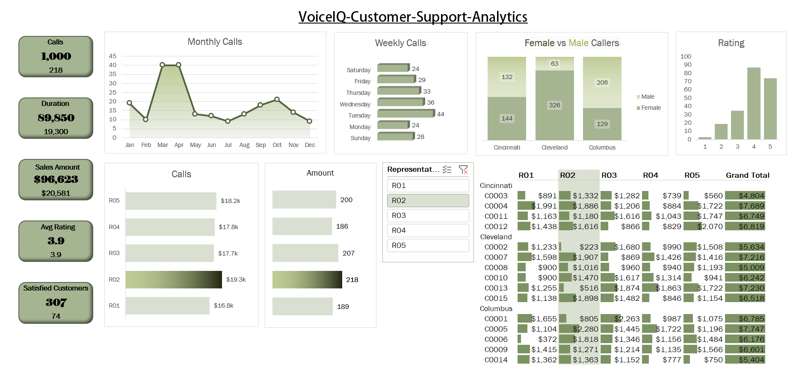

# 📞 Call Centre Performance Dashboard | Excel Project

## Dashboard Preview

## Project Overview
An interactive Excel dashboard built to analyze call centre 
performance across representatives, customer satisfaction, 
call duration, and purchase behavior. Built as part of a 
guided Excel portfolio project to demonstrate real-world 
data analytics skills.

## Dataset
- 1,000 call records across FY2023 and FY2024
- 5 Representatives: R01, R02, R03, R04, R05
- 3 Cities: Columbus, Cleveland, Cincinnati
- Fields: Call number, Customer ID, Duration, Purchase 
  Amount, Satisfaction Rating, Day of Week

## Business Questions Answered
1. How many calls are we getting per customer?
2. How satisfied are our customers?
3. Who are our top 10 customers?
4. Top 10 customers for a specific representative?
5. Call duration analysis — how long are calls?
6. How busy is the call centre in 2023?
7. Year-to-date (YTD) sales analysis
8. Which days of the week are the busiest?
9. Is there a link between call duration and satisfaction?
10. Which months need extra staffing?
11. Who are the time wasters? (high calls, low purchases)
12. Which reps need satisfaction training?

## Excel Skills Demonstrated
- Pivot Tables and Pivot Charts
- Slicers for interactive filtering
- Conditional Formatting
- FILTER, XLOOKUP, COUNTIFS, AVERAGEIF, MAXIFS
- TEXTJOIN, UNIQUE, SORT, LARGE
- GETPIVOTDATA with helper tables
- Duration bucketing and rating rounding
- YTD calculations
- Scatter plots with trendlines

## Key Insights
- Saturday is the busiest day for calls
- No strong link between call duration and satisfaction
- Time waster customers identified by purchase-per-call ratio
- Certain reps consistently score below average satisfaction

## How to View
1. Download the Excel file above
2. Open in Microsoft Excel 365
3. Navigate to the **Customer Center Report** sheet
4. Use slicers to filter by Representative, City, or FY

## Tools Used

